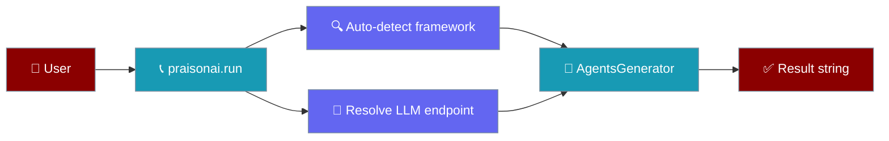
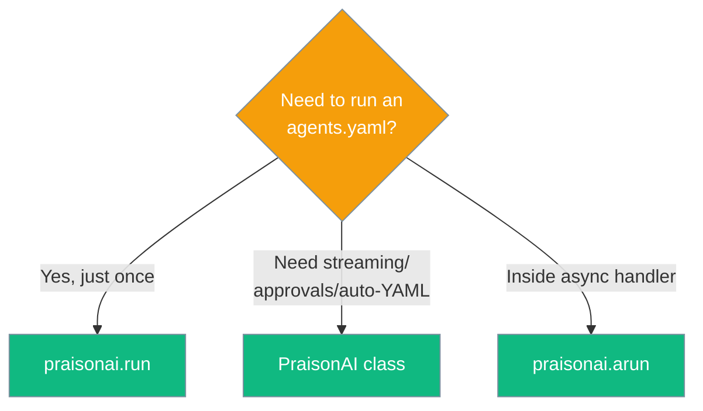

# Include praisonai package in your project

## Option 0: One-liner (simplest)

```python
import praisonai

result = praisonai.run("agents.yaml")
print(result)
```

That's it. `praisonai.run()` reuses the same framework auto-detection and LLM endpoint resolution the `praisonai` CLI uses, so anything that works on the command line works here.

### What it does

<Steps>
<Step>
  Auto-detects the first installed framework in this order: `crewai` → `praisonaiagents` → `autogen` → `ag2` → `agno`. Pass `framework="..."` to override.
</Step>
<Step>
  Reads `OPENAI_API_KEY`, `OPENAI_BASE_URL`, `OPENAI_MODEL_NAME` (and the standard PraisonAI key/config files) — same as the CLI.
</Step>
<Step>
  Returns the final task output as a string.
</Step>
</Steps>



### Async variant for FastAPI / Jupyter

```python
import praisonai

async def handler():
    result = await praisonai.arun("agents.yaml")
    return result
```

`arun()` offloads the synchronous work to a thread so it never blocks the event loop.

### Optional parameters

| Parameter | Type | Default | Description |
|-----------|------|---------|-------------|
| `agent_file` | `str` | required | Path to your `agents.yaml`. |
| `framework` | `str \| None` | `None` (auto-detect) | One of `"crewai"`, `"praisonai"`, `"autogen"`, `"ag2"`, `"agno"`. |
| `tools` | `list \| None` | `None` | Optional list of tool callables passed through to `AgentsGenerator`. |
| `agent_yaml` | `str \| None` | `None` | Inline YAML string; takes precedence over `agent_file` when both are given. |
| `cli_config` | `dict \| None` | `None` | Advanced: override the resolved CLI config (rarely needed). |

<Note>
If no framework is installed, `run()` raises `RuntimeError("No supported framework installed. Install one of: crewai, praisonaiagents, autogen, ag2, agno.")`. Install one with `pip install praisonaiagents` (recommended for new projects).
</Note>

### When to use `PraisonAI(...)` instead

Reach for the full `PraisonAI` class (Option 1 below) when you need:
- Streaming / approval-system integration
- Custom backends or the gradio UI
- The `auto="..."` natural-language-to-YAML mode
- Repeated runs against the same generator without re-parsing YAML



## Option 1: Using RAW YAML

```python
from praisonai import PraisonAI

# Example agent_yaml content
agent_yaml = """
framework: "crewai"
topic: "Space Exploration"

agents:  # Canonical: use 'agents' instead of 'roles'
  astronomer:
    role: "Space Researcher"
    goal: "Discover new insights about {topic}"
    instructions:  # Canonical: use 'instructions' instead of 'backstory' "You are a curious and dedicated astronomer with a passion for unraveling the mysteries of the cosmos."
    tasks:
      investigate_exoplanets:
        description: "Research and compile information about exoplanets discovered in the last decade."
        expected_output: "A summarized report on exoplanet discoveries, including their size, potential habitability, and distance from Earth."
"""

# Create a PraisonAI instance with the agent_yaml content
praisonai = PraisonAI(agent_yaml=agent_yaml)

# Run PraisonAI
result = praisonai.run()

# Print the result
print(result)
```

## Option 2: Using separate agents.yaml file


Note: Please create agents.yaml file before hand. If you only need to run an `agents.yaml` once and want zero ceremony, see [Option 0: One-liner](#option-0-one-liner-simplest) above. 

```python
from praisonai import PraisonAI

def basic(): # Basic Mode
    praisonai = PraisonAI(agent_file="agents.yaml")
    praisonai.run()

if __name__ == "__main__":
    basic()
```

## Other options

```python
from praisonai import PraisonAI

def basic(): # Basic Mode
    praisonai = PraisonAI(agent_file="agents.yaml")
    praisonai.run()
    
def advanced(): # Advanced Mode with options
    praisonai = PraisonAI(
        agent_file="agents.yaml",
        framework="autogen", # use AG2 framework (Formerly AutoGen)
    )
    praisonai.run()
    
def auto(): # Full Automatic Mode
    praisonai = PraisonAI(
        auto="Create a movie script about car in mars",
        framework="autogen" # use AG2 framework
    )
    print(praisonai.framework)
    praisonai.run()

if __name__ == "__main__":
    basic()
    advanced()
    auto()
```

## Logging in scripts

If you want PraisonAI to configure your application's logging, call `configure_cli_logging()` once at startup:

```python
from praisonai import PraisonAI
from praisonai._logging import configure_cli_logging

configure_cli_logging("INFO")  # opt in to root-logger setup
PraisonAI(agent_file="agents.yaml").run()
```

If you want PraisonAI to leave your application's logging untouched, just don't call `configure_cli_logging` — only namespaced `praisonai.*` loggers will be used.

